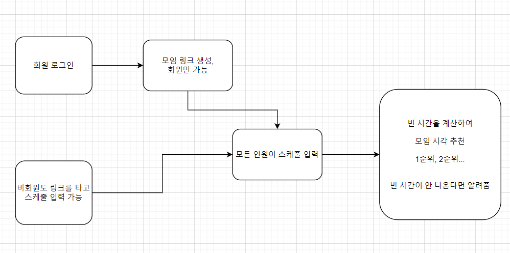

# 모임 약속 잡기 서비스 계획서

> 단체 모임 약속 시간을 잡아야 할 때, 각자 가능한 스케줄을 입력하면 
>
> 가능한 시간을 계산해서 추천해주는 웹 서비스

## 개발 환경

- Python

- Django

  

## 서비스 흐름

## 스케줄 입력 방식 개략도

- 약속 모임을 잡을 여유 기간을 자유롭게 정할 수 있으나, 모든 날짜의 스케줄을 한번에 입력하기는 어려우므로 1주일 단위로 스케줄을 입력하는 것으로 계획
- 日 단위의 스케줄 입력 방식은 선을 드래그해서 움직이는 방식으로, 자유롭게 스케줄을 입력할 수 있도록 구현하면 유저가 편할 듯 
  - 기존 시간표처럼 30분단위나 1시간 단위로 구분된 시간표가 아님
  - 선이 나타내는 시간을 보기 편하도록 선을 움직일때마다 해당 위치가 어느 시간에 해당하는지 표시하는 장치가 있어야함

## 시간 계산 방법

- 30분 단위, 1시간 단위로 스케줄을 입력 했다면, 모든 단위 시간마다 스케줄을 체크하는 방식으로 확인이 가능하지만

- 상기 계획한 대로 자유롭게 스케줄 정할 수 있게 하려면, 알고리즘의 난이도가 있을 것 같다
  - https://programmers.co.kr/learn/courses/30/lessons/17676
  - 위 문제가 이를 해결할 수 있을 듯

